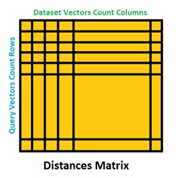

# DistanceCalculator

Project assumes implementation of distances calculator tool, designed to calculate distances between big numerical vectors, using different calculation engines, each one using different parallel programming techniques like C++17 standard library multithreading, MPI.

## Input

2 Sets of numeric vectors.
* First set is called “Query Vectors”.
* Second set is called “Dataset Vectors”.


## Output

Runtime details
* each calculation phase runtime
* total runtime

**Distances matrix**, containing distances of each query vector from every dataset vector. 



**Distance metrics:** L1, L2, Hamming.


## Building DistanceCalculator

### Release build:

```bash
mkdir build
cd ./build
cmake ..
make -j <job count>
```

### Debug build:

```bash
mkdir debug
cd ./debug
cmake -DCMAKE_BUILD_TYPE=Debug ..
make -j <job count>
```

### Build unit tests.
```bash
mkdir build
cd ./build
cmake -DBUILD_UNIT_TESTS=ON ..
make -j <job count>
```

### The simple execution example.

```bash
./bin/distance_calculator_exe -query <path>/query.csv -dataSet <path>/dataSet.csv -out res.csv -parallel
```

### The multi-process execution example.

```bash
mpirun -n 4 ./bin/distance_calculator_exe -query <path>/query.csv -dataSet <path>/dataSet.csv -out res.csv -parallel
```

### The command line options.

Option | Description
--- | ---
-query | The path to the CSV file, that contains query vectors (optional if not set generates randomly).
-dataSet | The path to the CSV file, that contains dataSet vectors (optional if not set generates randomly).
-out | The path to the output file. (optional if not set prints in stdout).
-parallel | Execute the parallel.
-metric | The math metric type L1, L2 or Hamming (default value is L1).
-dbg | Run application in debug mode.
-dumpTimeLog | Dump the tasks execution times into the time.log file.

## License

This project is licensed under the MIT License - see the [LICENSE](LICENSE) file for details
